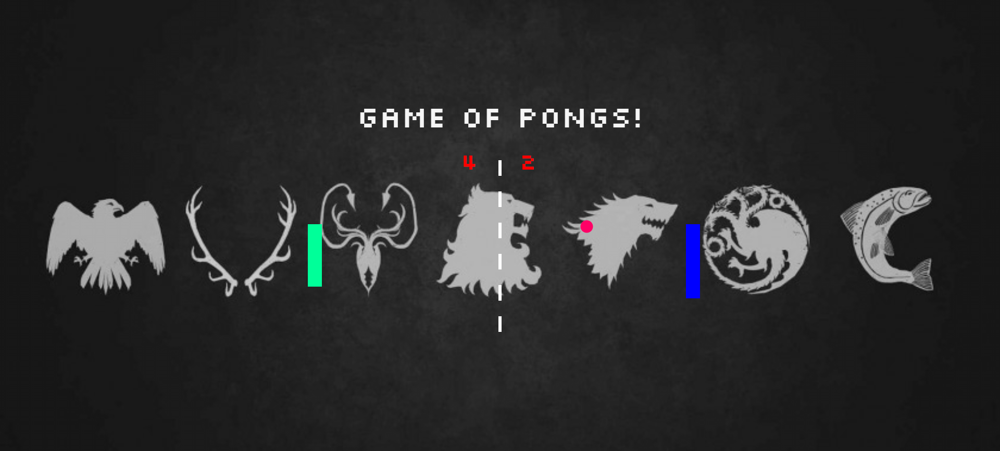
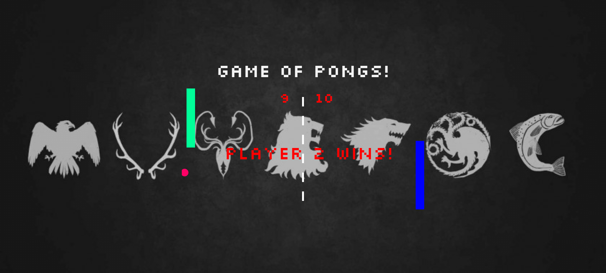

# Pong Game 

## When you play the Game Of Pongs, you either win or lose. There's no middle ground. :)

## GAME PREVIEW



## WINNER DECLARATION



A starter project for a basic pong game using SVGs.JavaScript (ES2015) is used to create the SVGs, move the ball, paddles, calculate the players' score, trigger audio during game play, and declare the winner.

## Setup

Ensure you have [Node.js](https://nodejs.org/en/) installed first.

**Install dependencies:**

`$ npm install`

**Run locally with the Parcel dev server:**

`$ npm start`

Once you run the start command you can access your project at http://localhost:3000.

Read more about the [Parcel web application bundler here](https://parceljs.org/).
 
 # Technologies Used

* HTML
* SVGs
* CSS (animation)
* JavaScript
* OOP with ES2015
* nodeJS
* Git & Github


## Keys
 
 #### Player 1
  
  * a : Up
  * z : Down

#### Player 2

  * ▲ : Up
  * ▼: Down

#### Pause
  
  Spacebar : To Pause

#### Trigger Multiple Balls

   m : Click once for triggering Multiple Balls

#### Reseting the ball to a single Ball
 
   m :Click once more to reset it to a single Ball


## FEATURES

* This is a Game of Thrones themed pong game for GoT Fans. 
* The Paddles changes color when they collide with the ball.
* The Paddles triggers a sound on collision with the ball.
* On Collision with the ball, the paddle which collides increases the size and the opponent paddles get decreased.
* To increase the difficulty level, 'm' key has the option which triggers multiple balls.
* If the 'm' key is pressed again the multiple balls are reset to one ball.
* If the Score of any player reaches 10, the player is declayered as the Winner.
* Background music is played on loop.


## Learnings

### Object Oriented Programming

Object-oriented programming (OOP) is a style of programming where you group code into encapsulated and reusable objects.
Object Oriented Programming (OOP) refers to using self-contained pieces of code to develop applications. We call these self-contained pieces of code objects, better known as Classes in most OOP programming languages and Functions in JavaScript. We use objects as building blocks for our applications. Building applications with objects allows us to adopt some valuable techniques, namely, Inheritance (objects can inherit features from other objects), Polymorphism (objects can share the same interface—how they are accessed and used—while their underlying implementation of the interface may differ), and Encapsulation (each object is responsible for specific tasks).

#### OOP in JavaScript
The two important principles with OOP in JavaScript are Object Creation patterns (Encapsulation) and Code Reuse patterns (Inheritance). When building applications, you create many objects, and there exist many ways for creating these objects: you can use the ubiquitous object literal pattern, for example:

```

import { SVG_NS} from "../settings";
export default class Score {
    constructor(x, y, size) {
      this.x = x;
      this.y = y;
      this.size = size;
    }
    render(svg, score) {
        let text = document.createElementNS(SVG_NS, 'text');
        text.setAttributeNS(null,'x', this.x);
        text.setAttributeNS(null,'y', this.y);
        text.setAttributeNS(null,'font-family', '"Silkscreen Web" , monotype');
        text.setAttributeNS(null,'font-size', this.size);
        text.setAttributeNS(null,'fill', 'red');
        text.textContent = score;


        svg.appendChild(text);

  }
}

```
 ### SVGs

 #### SVG Features

 - Solid browser support (standard was developed in 1999)
 - Scales like a champ, so SVGs look great on high-density pixel displays...but they're small! (best   of both worlds)
 - You can embed them directly in an HTML document (as inline SVGs) and target CSS or JS at them       just like normal DOM elements (and animate them!)
 - You can include them in the src attribute of an  element (as we have done), but you won't be   able to target CSS or JS directly at them

 ##### SYNTAX

 ```
 <svg
  xmlns="http://www.w3.org/2000/svg"
  version="1.1"
  viewBox="0 0 100 100"
  width="100"
  height="100"
>
  <rect x="0" y="0" width="50" height="50" />
</svg>

 ```


## Deploy

The deployment workflow for this project will be a bit different from what you've used when deploying simple static websites.

To deploy your finished Pong project as a GitHub page, you must first **update the `predeploy` script in the `package.json` file with the name of your repo.**

For example, if your repo URL is:

https://github.com/bob/pong-project

Update the `predeploy` script as follows:

```json
"predeploy": "rm -rf dist && parcel build index.html --public-url /pong-project",
```

Once you have done this, you can run:

`$ npm run deploy`

Now check out your deployed site 🙂


